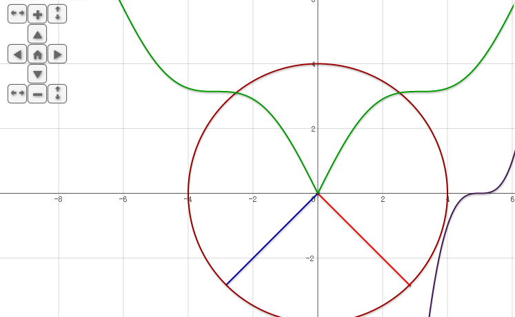
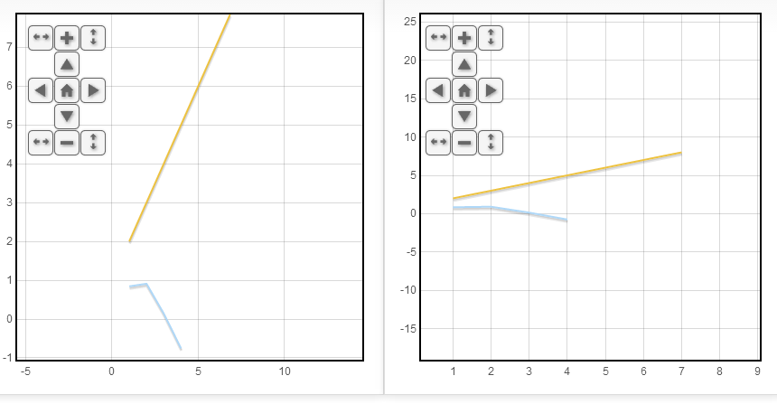

jquery.flot.navigationControl
=============================

Flot plugin that adds some navigation controls on top of the canvas layer to allow users pan or zoom the graph. This is even more helpful for the touch screen users.

Copyright (c) 2013 http://zizhujy.com.
Licensed under the MIT license.

##Usage:##
Inside the `<head></head>` area of your html page, add the following line:

`<script type="text/javascript" src="http://zizhujy.com/Scripts/flot/navigationControl/jquery.flot.navigationControl.js"></script>`

Now you are all set, there will be pan and zooming controls appear on your canvas.

##Online examples:##
- [Online Function Grapher](http://zizhujy.com/FunctionGrapher "Online Function Grapher") is using it.
- 
- [Online Plotter](http://zizhujy.com/en-US/Plotter "Online plotter") is using it
- [Basic Example](http://zizhujy.com/JsLibs/NavigationControl?example=BasicExample "Basic Example")
- [Work with multiple charts example](http://zizhujy.com/JsLibs/NavigationControl?example=MultipleCharts "Work with multiple charts Example")

##Dependencies:##
These navigation controls would only work if you have referenced jquery.flot.navigation.js plugin and enabled it already.

##Customizations:##

```javascript
options = {
		navigationControl: {
		homeRange: {xmin:-10,xmax:10,ymin:-10,ymax:10},
		panAmount: 100,
		zoomAmount: 1.5,
		position: {left: "20px", top: "20px"}
	}
};
```

To make the control symbols (+, -, ←, ↑, →, ↓, ⌂) more beautiful, you may include your own icon fonts css file, the symbols 
have the css class 'icon' for you to hook.

##Screenshots:##
#Look and feel:#


#Zoom in horizontally:#


#Zoom out vertically:#


#Work with multiple flot charts:#
